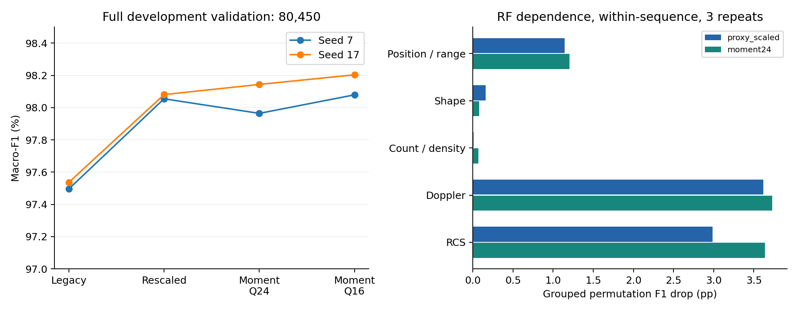
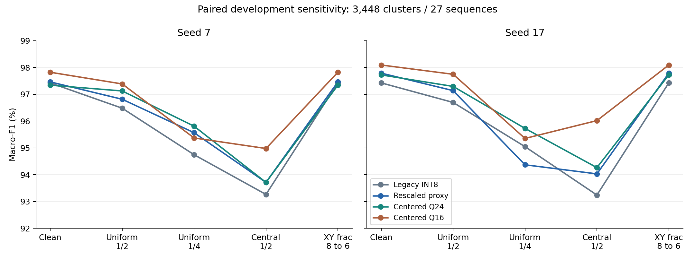

# 结果、归因与收敛判定

2026-09-16。[冻结计划](plan.json)先于新数据结果；最多六条新训练轨迹已完成后停止。下面都是开发 validation 与离线配对敏感性，不是独立最终测试、雷达实采遮挡实验或板测。

## 一分钟结论

输出定标是必须纳入的强基线。矩统计对部分减点条件有改善线索，但未全面超过简单方案；Q16 重训方案未通过预设容差，且两个 seed 都没有达到训练平台期。固定权重单独降低倒数精度却几乎不改变预测，因此不能把重训差异解释成 Q16 数值误差有害。本轮收敛的是候选范围与证据判断，尚未确立最终硬件质量—成本优势。

## 1. 全量匹配训练

完整 train 357,780 条/113 序列、validation 80,450 条/27 序列。保持原 K7、GT track、21→64→32→2 和训练协议；输出尺度只用 train，按训练损失规则停止，不取 validation 最高 checkpoint。保留全部 seed，旧基线直接复用已冻结 QAT。

| 表示 | seed 7 F1 (%) | seed 17 F1 (%) | QAT 停止 |
| --- | --- | --- | --- |
| Legacy INT8 | 97.4957 | 97.5364 | 旧包 28/39，均平台期 |
| Rescaled proxy | 98.0547 | 98.0806 | 55/21；均达到平台期 |
| Centered Q24 | 97.9643 | 98.1438 | 53/36；均达到平台期 |
| Centered Q16 | 98.0792 | 98.2036 | 60/60；均到预算上限，未达到平台期 |

仅重新定标相对旧 INT8 的差值为 **+0.5590/+0.5442 个 F1 百分点**。矩统计 Q24 相对重新定标为 **−0.0903/+0.0632 pp**，两个按序列重采样的 95% 探索区间均跨零。Q16 的全量分数不能掩盖没有达到训练平台期以及条件性退化。

原始评估见[评价汇总](../../../logs/conditional_statistics_20260916/evaluation/summary.json)，训练完整曲线见[六条轨迹汇总](../../../logs/conditional_statistics_20260916/training/summary.json)及各模型目录。训练总耗时 336.06 s，CPU 2 线程，无 GPU。

## 2. 点数与形态变化

每个验证序列最多 128 条，合计 3,448 条。不同条件用相同原始样本和标签。中心保留与均匀保留一半具有相同保留点数，可对比两种选择策略；但删点还会改变速度/RCS/位置分布，所以不能称纯形态因果实验。形态分组按原始簇协方差特征值比，仅用于评价；本轮候选不计算特征值。

| 表示 | seed | 原始 | 均匀 1/2 | 均匀 1/4 | 中心 1/2 | xy 小数 8→6 |
| --- | --- | --- | --- | --- | --- | --- |
| legacy | 7 | 97.4230 | 96.4795 | 94.7440 | 93.2626 | 97.4230 |
| legacy | 17 | 97.4237 | 96.6942 | 95.0441 | 93.2394 | 97.4237 |
| proxy_scaled | 7 | 97.4598 | 96.8131 | 95.5648 | 93.7116 | 97.4598 |
| proxy_scaled | 17 | 97.7873 | 97.1347 | 94.3679 | 94.0294 | 97.7873 |
| moment24 | 7 | 97.3374 | 97.1227 | 95.8083 | 93.7116 | 97.3374 |
| moment24 | 17 | 97.7218 | 97.2924 | 95.7251 | 94.2624 | 97.7218 |
| moment16 | 7 | 97.8202 | 97.3843 | 95.3696 | 94.9762 | 97.8202 |
| moment16 | 17 | 98.0907 | 97.7448 | 95.3509 | 96.0167 | 98.0907 |

矩统计 Q24 在均匀减半时，两 seed 的有害翻转为 **36/38**，重新定标为 **53/52**；保留四分之一时为 **86/98** 对 **107/142**。这是相对各自 clean 正确预测变错的数目，clean 正确集合不同，必须与同一扰动下的 F1、修复数、分组和配对区间一起看。

Q24 四分之一条件相对重新定标为 +0.2435/+1.3572 pp；seed 7 区间跨零、seed 17 不跨零。Q16 中心减半相对重新定标为 +1.2646/+1.9873 pp，两探索区间均为正，仍然包含重训差异，不能归于精度降低本身。这些区间未校正多重比较和既有 validation 使用。

按充分支持分组（≥100 条、≥3 序列、含两类）检查：Q24 seed 7 的中心减半/紧凑形状组比重新定标低 **1.4085 个 accuracy 百分点**；Q16 seed 7 的中心减半/保留 1–4 点组低 **2.1739 pp**。因此不能用总体改善宣称所有点数/形态都更稳。完整数据见[条件分组表](../../../logs/conditional_statistics_20260916/evaluation/conditional_groups.csv)。没有进行点数×形态交叉子组筛选，少数交叉组支持度仍未知。

坐标小数位从 8 降到 6 后，四种表示分别有 105/292/156/153 条特征向量变化，预测均未变；只支持这项预定扰动下分类不敏感，不支持任意坐标降精度都安全。

## 3. 精度误差与训练差异必须分开

预先声明的 Q16 重训接受门槛为：两 seed 在全量与全部五种条件下，相对 Q24 整体 F1 不低于 −0.1 pp，充分支持组 accuracy 不低于 −0.5 pp。**两 seed 均未通过**：均匀四分之一整体分别 −0.4387/−0.3742 pp，紧凑形状组分别 −1.8779/−2.3474 pp。容差为本轮探索约束，不是杜撰的业务指标。

另一方面，固定 Q24 权重，仅换成 Q16 前端：全量 seed 7 有 2 条变错/2 条修复，seed 17 为 0/1；五种诊断条件均无预测变化。事后归因审查补算的自然分组最差 accuracy 差为 −0.0106 pp，见[归因审计](../../../logs/conditional_statistics_20260916/attribution/summary.json)。这说明当前倒数误差绝大多数被后续输出量化和模型容忍；不能把不同优化轨迹产生的性能差异算成位宽收益或损失。事后分析没有修改原门槛或把被拒绝的重训方案改判通过。

未平移 Q16 在 train/validation 分别产生 **7,928/1,268 个负对角方差项**；平移 Q16/Q24 均为 0。这是数值缺陷得到修正的证据。固定模型下未平移 Q16 的全量 F1 相对 Q24 变化只有 +0.0065/−0.0012 pp，并不支持“消除负方差已经带来显著分类收益”。计数对象为方差项，不能写成同等数量的错误样本。

## 4. 森林参照和数据舍弃

运行了两个固定 RF（100 树、深度 16、最小叶节点 5、每树抽样 32,768、seed 7、CPU 2），合计 8.19 s；输入与 QMLP 相同，保持外部 validation 划分，没有树模型搜索。

| 表示 | 全量 F1 (%) | 原始子集 | 均匀 1/2 | 均匀 1/4 | 中心 1/2 |
| --- | --- | --- | --- | --- | --- |
| proxy_scaled | 97.7794 | 97.3018 | 96.8839 | 95.6174 | 93.1268 |
| moment24 | 97.8404 | 97.4843 | 96.8220 | 95.6484 | 94.3283 |

在 3,448 条 clean 子集内按序列做分组置换，重复三次，F1 平均下降如下。单位 pp；只描述当前模型依赖，不能直接产生删除名单。

| 组 | 旧代理重定标：下降 pp | 矩统计 Q24：下降 pp |
| --- | --- | --- |
| position_range | 1.1435 | 1.2054 |
| shape | 0.1606 | 0.0786 |
| count_density | 0.0098 | 0.0697 |
| doppler | 3.6195 | 3.7277 |
| rcs | 2.9843 | 3.6360 |

速度/RCS 组依赖更强，形状组较弱；但位置、范围、形状、密度相关，置换后的输入可能不满足真实几何关系，相关特征也会互相替代。不能由重要性低断定某个特征物理无用。RF 的中心减半改善 +1.2014 pp，为另一模型族的探索线索；RF 全量仅 +0.0610 pp，单 seed 不足以证明普适性。尚未运行后向删除或通过排名确认 21 最优。

恢复原始目标标签、有非空 GT track 的单次观测，在历史 min_points=3 之前统计：

| 划分 | 1/2 点观测数 | 目标类有轨迹观测总数 | 过滤比例 |
| --- | --- | --- | --- |
| train | 474,582 | 832,362 | 57.0163% |
| val | 97,734 | 178,184 | 54.8500% |

这是逐场景/传感器中同一 track 的**观测数**，不是雷达点数或独立物体数。保留 ≥3 点的观测与每个序列的原始 manifest 数量一致。统计明细见[过滤观测表](../../../logs/conditional_statistics_20260916/data/filter_observations.csv)。这些自然单点/两点观测尚未加入训练或评价，合成减点不能替代其真实覆盖。二分类以外标签、缺失 track 的点另见[过滤总览](../../../logs/conditional_statistics_20260916/data/filter_overview.csv)，当前任务没有对它们建立可靠分类结论。

## 5. 实现正确性与成本证据

Python/C 136 个合成边界案例通过；完整 train/validation 共 438,230 条旧特征镜像一致；6 个新模型在完整 validation 逐层 C/NumPy/QAT 无差异。真正单遍 C 前端在 **51,720** 个条件/模式组合中与参考 raw/INT8 一致；完整 C 点簇→特征→QMLP 在 **20,688** 个模型/样本组合中输出一致。

完整主机 C 候选与例子见[实现说明](01_算法与实现.md)。[共享成本图](../../../logs/conditional_statistics_20260916/shared/cost_graph.json)仅包含操作与位宽：矩统计增加每点 3 次空间乘积以及三个二阶累加器，共享原有四通道一阶和、极值与扫描，避免求平方根/特征值。Q16/Q24 倒数表逻辑位数为 8,704/12,800；实际 C 均用 uint32_t[512]，并没有实际存储字节差。FPGA 是否省 BRAM、LUT、DSP 或周期尚未测量。

旧参数、RTL、未测 bitstream 和最新版发布物均保持原状。不能拿旧位流的板测时延与本轮模型质量拼成 Pareto 点。
