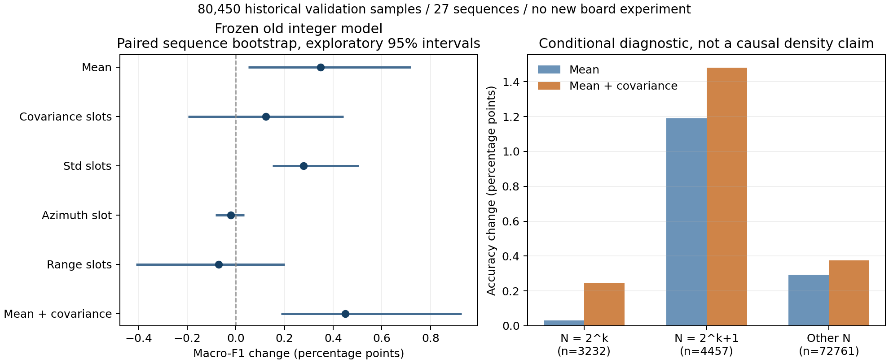
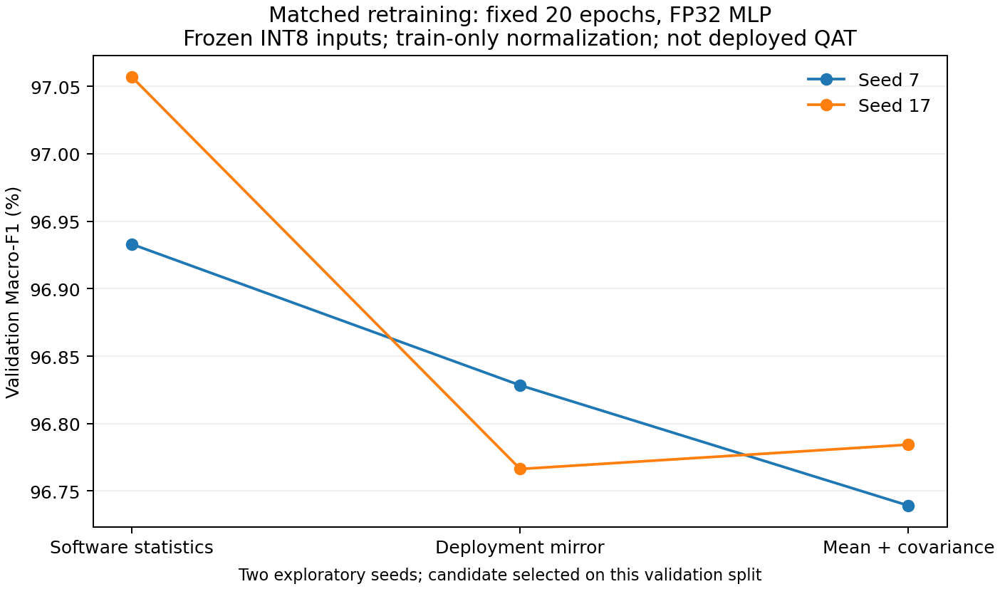

# 有约束的真实数据试验结果

2026-09-16。以下均为本地离线计算；固定旧整数模型诊断与重新训练的 FP32 表示对照分表报告，不能混成新硬件精度。历史 test 未参与新候选评价或选择。

## 1. 固定旧模型：完整 validation

共 80,450 条、27 个序列，保持原 K7。原始数据恢复核对、C/Python 特征及独立整数推理检查均通过。

| 模式 | Macro-F1（%） | 相对部署镜像（百分点） | 新增错误 | 修复错误 | ≥100样本序列：改善/退化 |
| --- | ---: | ---: | ---: | ---: | ---: |
| 软件统计参考 | 97.3893 | +0.7365 | 459 | 1025 | 21/3 |
| Q8.8 输入＋准确统计 | 97.3905 | +0.7378 | 458 | 1025 | 21/3 |
| 准确统计＋硬件输出量化 | 97.3920 | +0.7393 | 455 | 1023 | 21/3 |
| 当前部署镜像 | 96.6527 | +0.0000 | 0 | 0 | 0/0 |
| 均值修正 | 97.0008 | +0.3480 | 462 | 730 | 18/7 |
| 协方差槽位修正 | 96.7760 | +0.1232 | 221 | 318 | 16/6 |
| 标准差槽位修正 | 96.9300 | +0.2773 | 103 | 315 | 18/3 |
| 方位角槽位修正 | 96.6318 | -0.0210 | 43 | 26 | 5/8 |
| 距离槽位修正 | 96.5826 | -0.0702 | 364 | 305 | 10/12 |
| 均值＋协方差槽位修正 | 97.1033 | +0.4505 | 495 | 842 | 21/5 |

新增错误指部署镜像原本正确、干预后错误；修复错误指反方向变化。二者都依真实标签判断，不是与软件预测的一致率。

准确输入统计与原软件参考非常接近；当前观察主要指向统计/算式替换及模型适配，不能用这次结果证明“提高输入位宽”有必要。

## 2. 条件差异与不确定性

| 干预 | 整序列配对 bootstrap 的 F1 变化 95% 区间（百分点） |
| --- | --- |
| 均值修正 | [+0.0514, +0.7191] |
| 协方差槽位修正 | [-0.1961, +0.4424] |
| 标准差槽位修正 | [+0.1510, +0.5048] |
| 均值＋协方差槽位修正 | [+0.1865, +0.9270] |

这些区间使用 2,000 次、以整序列为单位的配对重采样，没有多候选/筛选校正；只能作为探索性不确定性描述。不得称为独立最终显著性证据。

点数分档中的边界组：N=2^k 有 3,232 条，N=2^k+1 有 4,457 条，其余 72,761 条。仅修正均值时，准确率变化分别约 +0.031、+1.189、+0.294 个百分点；2^k 组仍可能因舍入差别出现极少变化。

单独修正协方差在 N=65..128 的 8,842 条中反而降低准确率约 0.746 个百分点，而在细长组总体有益。类别、距离和序列分布可能混杂；不能由分组相关性断言点数本身就是原因。

形状误差与均值误差的收益不完全相加。上述槽位替换只是冻结模型上的诊断，成本与物理共享依赖尚未实现。

## 3. 有条件触发的匹配重训

按预定规则选择 `mean_eigen_corrected`。训练从 113 个 train 序列各取最多 512 条，共 49,255 条；保持原始 K7 历史并核对软件特征。

三种表示均使用 21→64→32→2 的 FP32 MLP，相同 seed 对应完全相同初始化与洗牌顺序，固定 20 epoch、相同优化器/预算。标准化和类别权重只由选中 train 计算，没有选择最佳 val checkpoint。

**输入已经量化为 INT8，但权重/激活和输入标准化使用 FP32。这是表示可学习性的对照，不是部署 QAT 或上板模型。不能把本表与上一表直接计算“训练带来的净提升”。**

| 表示 | seed 7 Macro-F1（%） | seed 17 Macro-F1（%） | 两 seed 均值（%） |
| --- | ---: | ---: | ---: |
| 软件统计参考 | 96.9330 | 97.0569 | 96.9949 |
| 当前部署镜像 | 96.8284 | 96.7663 | 96.7973 |
| 均值＋协方差槽位修正 | 96.7392 | 96.7844 | 96.7618 |

| 候选相对当前镜像 | F1 变化（百分点） | 整序列 95% 区间（百分点） |
| --- | ---: | --- |
| seed 7 | -0.0892 | [-0.3038, +0.1476] |
| seed 17 | +0.0180 | [-0.1648, +0.2232] |

两个 seed 和受限训练子集不足以证明收敛或稳健优势；候选还是在本 validation 上选出的。这里检验固定旧模型的现象能否在匹配重训后保留，而非最终论文成绩。

## 4. 本轮决策

候选在匹配重训后未达到两个 seed 均有明确正向差异的状态。应保留机制发现，同时暂停据此增加硬件复杂度；优先把当前镜像的匹配训练与冻结整数导出做扎实。该判断不等于证明候选永远无效。

本轮不再扩大 seed、模型或参数网格，也不开始 RTL 设计。后续研究仍应区分“可训练适配的偏差”和“确实丢失的判别信息”；先修正评价闭环，再决定是否值得付出硬件代价。

## 5. 资源与证据

固定模型全量诊断 80.15 s。
训练数据准备 141.13 s；六次训练及汇总 13.69 s。均未超过预定阶段上限，GPU 作业为 0。

- [冻结执行计划](plan.json)与[执行前评审](01_执行边界与评审.md)。
- [完整固定模型结果](../../../logs/feature_approximation_pilot_20260916/full/summary.json)。
- [分组结果 CSV](../../../logs/feature_approximation_pilot_20260916/full/group_metrics.csv)与[序列结果 CSV](../../../logs/feature_approximation_pilot_20260916/full/sequence_metrics.csv)。
- [匹配训练结果](../../../logs/feature_approximation_pilot_20260916/training/summary.json)；每个模型的曲线、checkpoint 与 validation logits 均保存在同目录。

原权重、RTL、ELF、bitstream 保留；旧硬件正确性证据仍按原口径有效。本轮没有测量面积、时延或能耗，不能绘制真实质量—硬件成本 Pareto 前沿。
