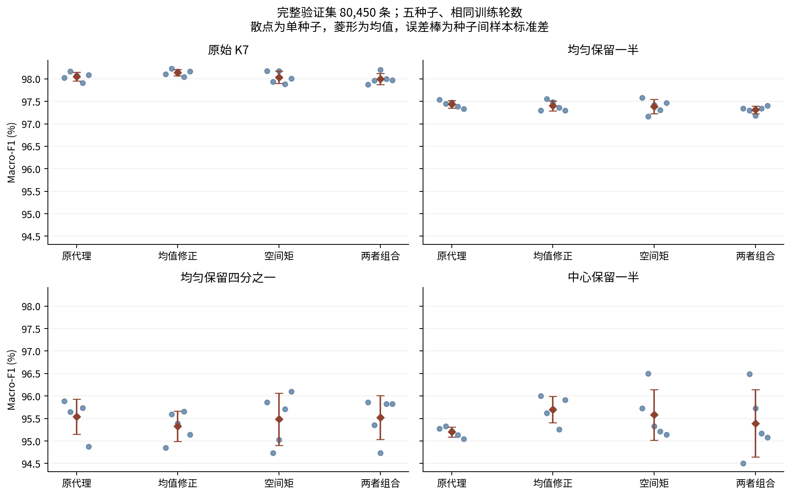
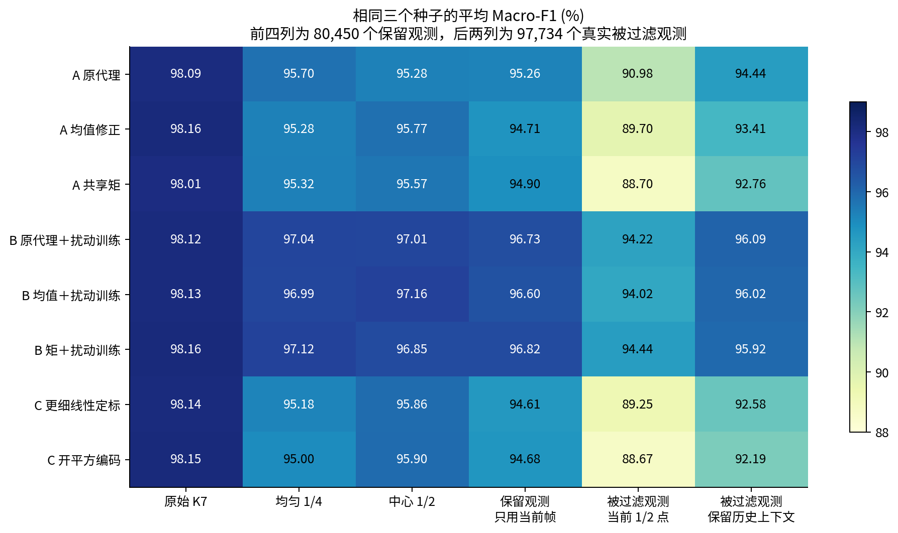
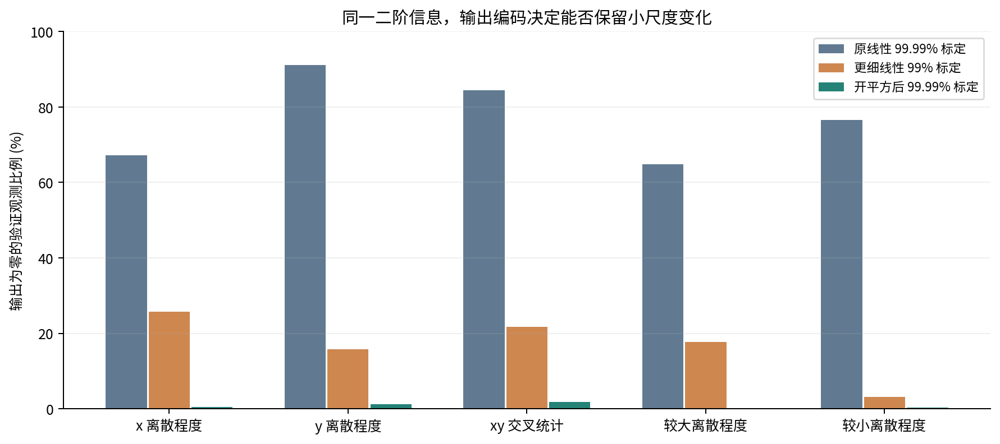

# 扩展试验结果与所得认识

2026-09-16。完成 **35 条固定轮数训练轨迹**：四组机制×五种子 20 条、三表示×三种子的扰动训练 9 条、两种输出编码×三种子 6 条。每条都是完整 train 357,780 条、20 轮 FP32＋60 轮冻结 QAT，固定采用第 60 轮，未挑验证最高 checkpoint。前一次研究的提前停止模型只作历史，不混入新公平对照。

训练总耗时 40.86 分钟，CPU 2 线程，GPU 0。验证仍为熟悉的 27 序列/80,450 条；新增检查 97,734 个真实被过滤的目标类有轨迹观测。派生输入和多个 seed 不是新增独立数据集。旧 test 不再参与本轮。

## 1. 五种子机制拆分：修正收益不能直接相加

固定原 21 个槽位，只改变均值路径与五个空间统计槽。A 阶段全部使用原始训练输入，输出定标沿用此前 train 冻结结果。

| 表示 | 原始 K7 | 均匀保留一半 | 均匀保留四分之一 | 中心保留一半 |
| --- | --- | --- | --- | --- |
| 旧代理＋逐特征定标 | 98.0507 ± 0.0962 | 97.4358 ± 0.0815 | 95.5403 ± 0.3899 | 95.2006 ± 0.1132 |
| 只修正均值 | 98.1393 ± 0.0723 | 97.3992 ± 0.1142 | 95.3267 ± 0.3342 | 95.6979 ± 0.2910 |
| 只替换空间矩 | 98.0352 ± 0.1366 | 97.3865 ± 0.1588 | 95.4868 ± 0.5809 | 95.5829 ± 0.5620 |
| 均值＋空间矩 | 98.0004 ± 0.1229 | 97.3129 ± 0.0841 | 95.5212 ± 0.4867 | 95.3928 ± 0.7478 |

表中为 Macro-F1 % 的均值±种子间标准差，不是置信区间。共同 seed 为 7/17/37/47/57；同 seed 初始网络哈希一致，训练更新次数一致。

| 条件 | 效应 | 五种子均值差 pp | 配对序列＋种子重采样 95% 区间 pp |
| --- | --- | --- | --- |
| clean | mean_with_proxy_shape | +0.0886 | [-0.0509, +0.2852] |
| clean | shape_after_mean | -0.1390 | [-0.4779, +0.1114] |
| clean | interaction | -0.1235 | [-0.4634, +0.0677] |
| uniform_quarter_0 | mean_with_proxy_shape | -0.2136 | [-0.7806, +0.2957] |
| uniform_quarter_0 | shape_after_mean | +0.1945 | [-0.4300, +1.0067] |
| uniform_quarter_0 | interaction | +0.2479 | [-0.4437, +1.0209] |
| central_half | mean_with_proxy_shape | +0.4973 | [+0.1861, +1.1396] |
| central_half | shape_after_mean | -0.3051 | [-1.2346, +0.5491] |
| central_half | interaction | -0.6873 | [-1.7809, -0.1425] |

`shape_after_mean` 是增加空间矩相对只修正均值；`interaction` 为“两者组合−均值−空间矩＋原代理”。非零交互说明两种修正的模型收益不能机械相加。区间采用整序列和匹配 seed 重采样 2,000 次，属于探索性证据，未校正多重比较及长期使用 validation 的选择效应。

完整结果：[A 评价](../../../logs/mechanism_convergence_20260916/factorial_evaluation/summary.json)、[A 条件及交叉分组](../../../logs/mechanism_convergence_20260916/factorial_evaluation/conditional_groups.csv)。支持门槛为 ≥100 条、≥3 序列、两类均存在；不把不充分的组补成 0 分。

## 2. 训练覆盖、统计和输出编码分别比较

B 阶段由预先门槛触发：至少 4/5 个原代理 seed 在均匀四分之一或中心一半条件损失 ≥1 个 F1 百分点。训练每轮仍访问每个原样本一次，输入视图按 50% 原始、25% 均匀四分之一、25% 中心一半选择；统计量、类别权重与轨迹划分保持对应约束，标准化和 QAT 校准仅使用 train 混合分布。没有额外训练数据标签、教师、网络结构或损失搜索。

C 是另行冻结的六条编码试验，针对发现的二阶量输出大量为零；它没有做扰动训练。下表统一仅取 seed 7/17/37，避免拿五种子平均与三种子平均解释纯训练差。

| 训练/表示 | 原始 K7 | 均匀 1/4 | 中心 1/2 | 保留观测当前帧 | 过滤观测 1/2 点 | 过滤观测＋历史 |
| --- | --- | --- | --- | --- | --- | --- |
| A 原代理 | 98.0875 | 95.6961 | 95.2759 | 95.2569 | 90.9775 | 94.4448 |
| A 均值修正 | 98.1637 | 95.2777 | 95.7712 | 94.7050 | 89.7034 | 93.4086 |
| A 共享矩 | 98.0127 | 95.3177 | 95.5725 | 94.9036 | 88.6988 | 92.7566 |
| B 原代理＋扰动训练 | 98.1205 | 97.0365 | 97.0093 | 96.7307 | 94.2235 | 96.0886 |
| B 均值＋扰动训练 | 98.1266 | 96.9924 | 97.1564 | 96.5959 | 94.0208 | 96.0203 |
| B 矩＋扰动训练 | 98.1637 | 97.1239 | 96.8467 | 96.8205 | 94.4409 | 95.9198 |
| C 更细线性定标 | 98.1350 | 95.1779 | 95.8629 | 94.6133 | 89.2540 | 92.5775 |
| C 开平方编码 | 98.1462 | 94.9960 | 95.8992 | 94.6846 | 88.6696 | 92.1885 |

前四列对应相同的保留观测身份；后两列来自原 min_points=3 过滤掉的观测，不能把跨列差值当同一群体的因果下降。所有输入仍基于 GT track；模拟删点尚非经过标定的遮挡模型。

每次均匀减点实际做了三个固定随机重复，中心保留一半与均匀保留一半使用相同保留点数；另外检查坐标小数位 8→6/4。完整逐 seed/重复、类别 F1、混淆矩阵及有害/修复翻转保留在 [A 汇总](../../../logs/mechanism_convergence_20260916/factorial_evaluation/summary.json)、[B 汇总](../../../logs/mechanism_convergence_20260916/augmentation_evaluation/summary.json)与 [C 汇总](../../../logs/moment_encoding_20260916/evaluation/summary.json)，不能只挑一条最好的减点随机序列。

## 3. 更准确的二阶矩，可能被输出量化消掉

原 Q24 空间统计的 x/y 原始方差在完整验证集中均非零，最终 INT8 却分别有 **67.1361%/91.2020%** 为零。这里直接核对了原始整数矩和输出值，不能把这些零解释为所有目标都没有空间变化。

原因是方差与标准差的动态范围不同，而原试验对方差按高百分位做均匀 INT8 定标。平方根编码将方差变为标准差，对协方差使用保留符号的平方根，复用两轴标准差得到最大/最小输出；不增加点循环中的乘积数量，但增加三次簇末整数平方根。

| 编码 | x/y 两槽输出尺度指数 e | 验证 x/y 输出零比例 | 验证空间槽位最大实际限幅比例 |
| --- | --- | --- | --- |
| linear_fine | [0, -2] | 25.7837%/15.7489% | 0.5308% |
| root | [-2, -2] | 0.5370%/1.1473% | 0.0000% |

更细线性方案是必要对照：只降低空间槽的标定百分位，判断是否用简单的尾部限幅就能恢复足够信息。不得把尺度变化的全部收益记在非线性变换名下。C 的计划、Python/C 全量根号一致性及训练协议见[输出编码专项](../moment_encoding_2026-09-16/README.md)。

## 4. 位宽结论要与输出编码及共享依赖一起看

固定每个已经训练好的权重，仅更换均值/空间矩倒数精度；对四个主要条件及支持充分的点数、形态、交叉组检查。以下为通过所有门槛的 seed 数/全部 seed 数，门槛为整体 F1 下降≤0.1 pp、组 accuracy 下降≤0.5 pp。它是预定探索约束，不是业务安全指标。

| 模型/训练 | 均值8/空间8 | 12/12 | 16/16 | 12/24 | 24/12 |
| --- | --- | --- | --- | --- | --- |
| 均值修正 A | 1/5 | 3/5 | 5/5 | 3/5 | 5/5 |
| 共享矩 A | 0/5 | 5/5 | 5/5 | 5/5 | 5/5 |
| 均值修正 B | 0/3 | 3/3 | 3/3 | 3/3 | 3/3 |
| 共享矩 B | 1/3 | 3/3 | 3/3 | 3/3 | 3/3 |
| 更细线性 C | 0/3 | 2/3 | 3/3 | 3/3 | 2/3 |
| 开平方 C | 0/3 | 2/3 | 3/3 | 3/3 | 3/3 |

最小可用位宽是当前表示、权重、条件和支持范围下的结果。尤其不能用粗输出下“不敏感”的结果，直接替细输出做精度保证。单组接近 100 条时少数翻转就可能触发保守门槛，未通过也不等于证明统计显著损害。

均值和协方差共用一阶和与倒数。把两个输出分别降到各自最低位宽，可能需要第二个倒数和重复空间均值计算；未必比统一使用一个稍高精度倒数更便宜。结构成本见[共享计算图](../../../logs/mechanism_convergence_20260916/implementations/cost_graph.json)。所有 C 交付候选仍采用明确的 Q24 参考配置，低位宽对照没有被悄悄当成已发布硬件。

## 5. 真实少点观测揭示了适用范围

本次恢复验证域内全部 **97,734** 个目标标签、非空 GT track、当前观测仅 1/2 点的样本；加上原 80,450 个保留观测，共 **178,184** 个目标观测。原保留覆盖率为 **45.1500%**。这不是全部雷达点或独立物体的覆盖率。

两个视图分别使用当前点，以及前面最多六个原流程保留观测＋当前点；被过滤观测不更新历史，以隔离原筛选策略。每个原保留 K7 观测都重新匹配了冻结输入，没有悄悄改掉基线。上下文、当前点数、距离的分组结果见 [A 少点分组](../../../logs/mechanism_convergence_20260916/factorial_evaluation/sparse_groups.csv)、[B 少点分组](../../../logs/mechanism_convergence_20260916/augmentation_evaluation/sparse_groups.csv)。

自然少点改善可以作为迁移线索，但这些仍来自已有 validation 序列，不能充当新的独立最终测试，也没有解决无 GT 轨迹的检测、聚类、关联问题。当前历史 K7 无时间到期和跨帧姿态补偿的限制继续存在。

## 6. 21 维与分档均值的具体证据

在完整 train 和 validation 同时精确相同的槽位对：**proxy：[6, 10]；mean：[6, 10]**（槽号从 0 开始）。精确重复仅对相应表示成立；新协方差槽与旧 y 跨度的语义已经不同，不能套同一份删除清单。本轮没有把 21 维写成独立且最优，也没有通过零值或 RF 排名自动删维。

原分档均值在舍入前相当于给真实均值乘 `N / 2^ceil(log2(N))`。本验证集这一系数的均值为 **0.750940**，恰好为 1 的观测比例为 **4.0174%**。它是确定的数值偏差，不是同等比例的分类错误；网络可能补偿部分偏差。按减点前后该系数变化分组的结果见[机制归因](../../../logs/mechanism_convergence_20260916/mechanism_audit/count_phase_groups.csv)。

## 7. 实现与证据边界

35 个最终模型都完成完整 validation 的逐层 C/NumPy/QAT 一致性检查；真正按编译时开关裁掉不用运算的单遍 C 统计＋整数网络，累计 **2,815,750** 个模型/观测组合对拍通过。原代理没有二阶乘积；均值修正只有四通道一阶和与簇末倒数乘法；空间矩增加每点三个乘积；开平方编码再增加每簇三次整数平方根。这里报告的是可运行 C 及逻辑计算依赖，不是 FPGA LUT/DSP、时钟、功耗或实测加速比。

一条早期训练因新包装器接口错误在首次验证输出前终止，原源码与日志保留，修正后所有有效比较统一用相同版本。编码专项的来源路径错误在任何模型初始化前修复，未产生额外模型。详见两包 `runner_fix.json`；不能把失败尝试伪装为有效训练或悄悄删除。

最终执行、旧工件保护与同步校验见[validation.json](validation.json)。方法是否构成论文原创贡献、独立确认集、真实硬件质量—成本证据，仍需分别完成；现有板卡资源充足，不以“塞不下”为泛化理由。
