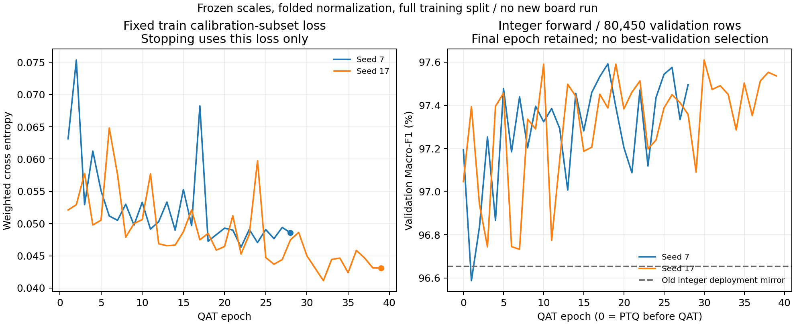

# 冻结 INT8 训练：结果与收敛判定

2026-09-16。本轮仅训练当前 Feature21 硬件镜像，没有加入均值或协方差修正。完成完整训练集、标准化折叠、冻结尺度 QAT、独立参数导出和 C/NumPy/Torch 整数逐层校验。以下分类质量来自开发 validation，不是新的上板结果或独立测试成绩。

## 1. 分类质量

357,780 条 train / 113 个序列；80,450 条 validation / 27 个序列。两个 seed 使用同一预定协议，各自从随机初始化开始。最终保留训练停止时的模型，没有挑选验证集最高分 epoch。

| 模型阶段 | seed 7 Macro-F1（%） | seed 17 Macro-F1（%） |
| --- | ---: | ---: |
| 原冻结整数模型＋当前硬件镜像 | 96.6527 | 96.6527 |
| 当前镜像匹配的浮点预训练 | 97.4681 | 97.4330 |
| 折叠后直接量化 PTQ | 97.1940 | 97.0469 |
| 冻结尺度 QAT 最终导出 | 97.4957 | 97.5364 |

旧模型一行是同一个历史模型，重复两列只是对齐表格，不是两个旧 seed。PTQ 是同一 warmup 权重的量化对照；QAT 在其上继续训练。旧模型与新模型还存在训练数据表示、归一化、损失与训练协议差异，不能把总收益全部归因于冻结 observer 或 QAT 本身。

| 最终模型相对旧整数部署镜像 | F1 变化（百分点） | 整序列配对 95% 区间（百分点） | 新增错误 / 修复错误 |
| --- | ---: | --- | ---: |
| seed 7 | +0.8429 | [+0.4693, +1.6031] | 571 / 1218 |
| seed 17 | +0.8837 | [+0.4764, +1.6660] | 504 / 1180 |

区间按 27 个完整序列进行 2,000 次配对重采样，描述开发 validation 上的不确定性；不能消除该验证集在历次研究中被使用带来的开发偏差。所有逐序列结果保存在[CSV](../../../logs/qmlp_int8_convergence_20260916/verification/sequence_metrics.csv)。

## 2. 是否收敛

| seed | 浮点预训练 epoch | QAT 停止 epoch | 训练损失平台期 | 末 5 epoch 验证 F1 跨度（百分点） | ≤0.3 个百分点 |
| --- | ---: | ---: | --- | ---: | --- |
| 7 | 20 | 28 | 满足预设规则 | 0.2417 | 是 |
| 17 | 20 | 39 | 满足预设规则 | 0.2010 | 是 |

平台期依据是固定训练校准子集最近与此前两个 5-epoch 窗口的平均损失差，连续两次低于计划阈值。验证曲线没有用于提前停止。它给出“本轮优化已进入操作性平台期”的证据，不证明参数不再变化、全局最优或数据分布外稳定。

## 3. 整数导出闭环

- 标准化只在浮点预训练存在，已经代数折叠进第一层；最终输入仍为原始 Feature21 INT8，推理时不需要额外标准化算子。
- 权重/激活尺度与乘数在 QAT 前冻结；评价期间不更新 observer，保存并核对缓冲区哈希。
- 现有 C 推理函数主体使用独立新参数头文件编译；完整 validation 和额外边界/随机输入的两层 INT8 激活、INT32 logits 与 NumPy 和 QAT 前向逐项一致。
- 重载 checkpoint 与导出 NPZ 一致；导出的 Scala 尺度能重建同一乘数；不同 batch 切分及样本顺序不改变结果。

| seed | 完整验证输入 | 额外随机/边界输入 | 三层不一致计数 | 最终 L1 / L2 乘数 |
| --- | ---: | ---: | --- | --- |
| 7 | 80,450 | 1,028 | [0, 0, 0] | [16599, 599] |
| 17 | 80,450 | 1,028 | [0, 0, 0] | [15853, 373] |

输出已验证为离线整数候选，但当前 RTL release 路径和旧位流仍引用原参数。新增乘数会改变常量乘法结构，不能直接沿用旧 FPGA 时序、面积、功耗或板测准确率。

## 4. 交付与下一步

- [seed 7 候选参数目录](../../../logs/qmlp_int8_convergence_20260916/training/seed7/final_export)：C 头文件、Scala 参数、NPZ、元数据和 C 推理库。
- [seed 17 候选参数目录](../../../logs/qmlp_int8_convergence_20260916/training/seed17/final_export)：相同格式，完整保留第二个 seed。
- [独立离线推理入口](run_candidate.py)：直接读取 `N×21 int8 .npy`，输出 `N×2 int32 logits`；不会改动原模型。
- [训练汇总](../../../logs/qmlp_int8_convergence_20260916/training/summary.json)、[逐层校验与区间](../../../logs/qmlp_int8_convergence_20260916/verification/summary.json)。

这轮已把上一轮“下一步先建立可信部署基线”的软件部分落地。后续顺序已按用户追问修订：先补随机森林参照、特征重要性、有限消融和历史样本过滤统计，再决定候选与 RTL 接入，详见[特征筛选优先级](04_先完成特征筛选与样本审计.md)。新候选应与本轮匹配训练和冻结导出基线比较，不能只对固定旧权重宣称收益。

训练样本仍来自真值轨迹，K7 时间假设仍沿用历史定义；尚未解决独立最终测试来源和有界时间窗。新模型提高开发验证分数不能替代这些评价边界，也不自动形成论文新算法贡献。

## 5. 预算与复核

完整训练缓存 239.56 s；两条训练轨迹合计 89.85 s；独立整数验证 2.86 s。均在预定上限内，本轮 GPU 作业为 0。

数据恢复全部软件特征、标签、点数和旧 49,255 条镜像子集核对均无差异；train/validation 序列交集为 0。原始模型与硬件产物按既有保护清单检查，最终状态见 [validation.json](validation.json)。
