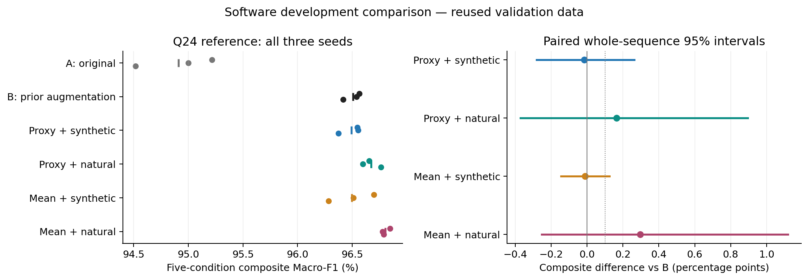

# 软件收敛：一页结论

**本轮已经做完。按预定规则，保留原常规训练 A 为主基线、原扰动训练 B 为困难条件备选。还没有找到能兼顾全部关键条件的统一替代方案。** 这是完成 12 条训练和全量评价后的取舍，不需要等待板卡才能得到。

最值得记住的三个发现：

1. **真实少点有用。** 在相同表示下，用真实少点替代合成少点，真实单帧少点 Macro-F1 平均提高约 **1.06～1.45 个百分点**，但没有让全部条件同时改善。
2. **均值更准，不保证整体更好。** 它的收益随训练覆盖变化。“均值＋真实少点”相对 B，真实单帧少点从 **94.22% 到 95.48%**，中心保留条件却从 **97.01% 降到 96.69%**；部分紧凑形态小组也退步，未通过门槛。“均值＋合成少点”的退步控制较好，综合收益则不稳定。
3. **目前没有充分理由增加部署计算。** A/B 继续用同一代理统计及同规模整数网络，交付为两套独立配置。均值候选、负结果和三个种子完整保留，不把 A 的保留说成它在全部指标上最优。

已完成：恢复 **474,582** 条真实少点训练观测；12 条训练；13 种评价条件；三种子、类别指标、全部分组、错误翻转和 2,000 次序列配对区间；固定权重 Q12/Q16/Q24 检查；主基线与备选三个种子的 **1,655,508** 次完整点簇→特征→logits C 对拍，零差异。没有新增 RTL、SoC、位流或板测。

本轮收口的是**给定候选和规则下的软件方案选择**。验证数据已多次使用，独立泛化确认仍待补；没有证明最终 FPGA 性能/能耗优势。21 维、二分类、GT 轨迹历史均保留适用边界。

按需要阅读：

- 看数字与拒绝理由：[结果与选型](02_结果与选型.md)。
- 看论文怎么写：[论文结论与证据](03_论文结论与证据.md)。
- 看为什么会这样：[归因补充](06_归因补充.md)。
- 拿代码运行：[C 软件包](candidate_c_bundle.zip)、[软件契约与复现](04_软件契约与复现.md)。
- 查设计与审计：[设计账本](00_设计账本与执行前审查.md)、[开跑前复核](01_开跑前复核.md)、[反思记录](05_执行反思与失败记录.md)、[最终审计](validation.json)。
- 查备份与同步：[回执](backup_sync_receipt.json)。Git 独立分支 `backup/radar-thesis-20260917-software`；Obsidian 共享目录中的本包附有实际证据文件。

